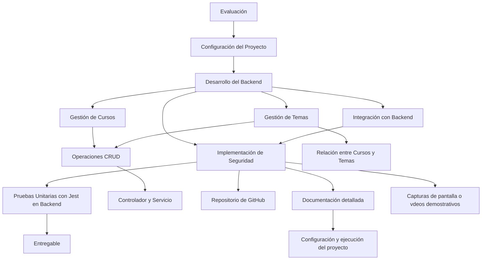

# Sistema de Gestión de Cursos para Docentes

# Solicitudes Cursos

# Solicitudes Temas

## Descripción

 Este proyecto es un Sistema de Gestión de Cursos para Docentes utilizando el framework NestJS. Permite a los usuarios realizar operaciones CRUD (Crear, Leer, Actualizar y Eliminar) en los cursos y sus temas asignados. La aplicación sigue una arquitectura modular y está diseñada siguiendo los principios de una API RESTful. 

## Funcionalidades

- Crear un nuevo curso y temas
- Leer los cursos y los temas
- Actualizar los cursos y los temas
- Eliminar los cursos y sus temas

## Tecnologías utilizadas

- NestJS
- TypeScript
- Docker
- Docker Compose
- MongoDB

## Instalación

- Instala las dependencias: npm install

## Uso

- Inicia el servidor de desarrollo utilizando docker desktop: `docker compose up -d`
- Realiza las peticiones HTTP utilizando una herramienta como Thunder Client.

## Endpoints

- **GET /courses**: Obtiene todos los cursos disponibles.
- **GET /courses/:id**: Obtiene un curso específico por su ID.
- **POST /courses**: Crea un nuevo curso.
- **PUT /courses/:id**: Actualiza un curso existente por su ID.
- **DELETE /courses/:id**: Elimina un curso existente por su ID.

- **GET /topics**: Obtiene todos los temas disponibles.
- **GET /topics/:id**: Obtiene un tema específico por su ID.
- **POST /topics**: Crea un nuevo tema.
- **PUT /topics/:id**: Actualiza un tema existente por su ID.
- **DELETE /topics/:id**: Elimina un tema existente por su ID.

## Licencia

[MIT](LICENSE)

## Evaluación

Se evalúa la necesidad de desarrollar un sistema de gestión de cursos para docentes.

## Configuración del Proyecto

Se utiliza Nest.js para configurar el backend y se establece una base de datos MongoDB para almacenar la información de los cursos y los temas.

## Desarrollo del Backend

Se crea un módulo para la gestión de los cursos, con operaciones CRUD, así como un controlador y un servicio para la lógica de negocio relacionada. Se desarrolla también un módulo para la gestión de los temas de los cursos, estableciendo la relación entre cursos y temas.

## Implementación de Seguridad

Se implementan medidas de seguridad en el backend para proteger las rutas y acciones del sistema, utilizando técnicas como la autenticación basada en tokens JWT.

## Pruebas Unitarias con Jest en Backend

Se escriben pruebas unitarias para verificar el correcto funcionamiento de los controladores y servicios del backend, utilizando Jest como framework de pruebas.

## Entregable

Se entrega un repositorio de GitHub con el código fuente del proyecto, documentación detallada sobre la configuración y ejecución del proyecto, y capturas de pantalla o vídeos demostrativos que muestren el sistema en funcionamiento.

Para visualizar y probar la generación del sistema backend, así como su consumo desde un Frontend, puedes utilizar herramientas como Thunder Client, Postman, Insomnia o RapidApiClient. Estas herramientas permiten realizar solicitudes HTTP a los endpoints del backend, lo que facilita la visualización de los datos y el funcionamiento del sistema en tiempo real.
